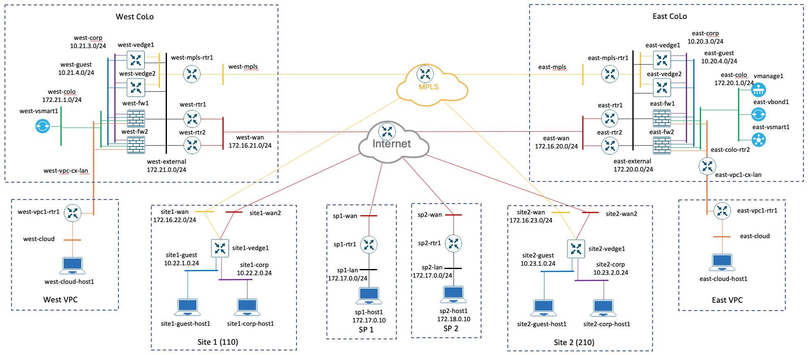

# PS-CRN Automation

This is VIRL topology and automated tooling for the [Public Sector Cloud Read Network](README.md).

## Requirements

* [virlutils](https://github.com/CiscoDevNet/virlutils)
* [ansible-viptela](https://github.com/CiscoDevNet/ansible-viptela)
* A Viptela license file and the Organization name associated with that license file.  The Organization name should be provided where you see: `<your org name>`

## Topology

_The default username/password is `admin/admin`_

## Using the Topology
* [Building the topology](build.md)
* [Operating the topology](operate.md)
* [Cleaning the topology](clean.md)